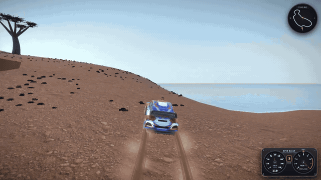
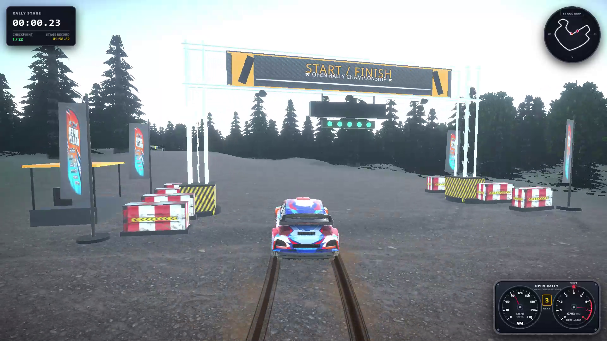
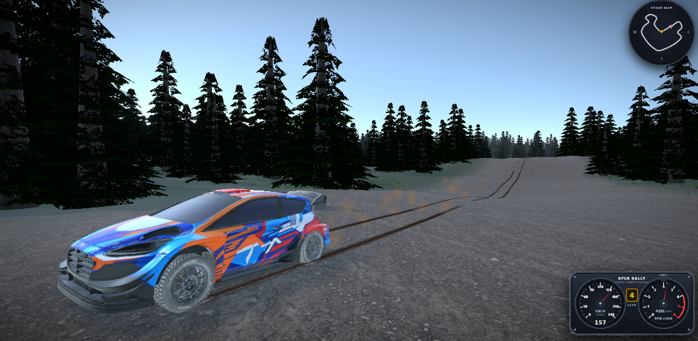
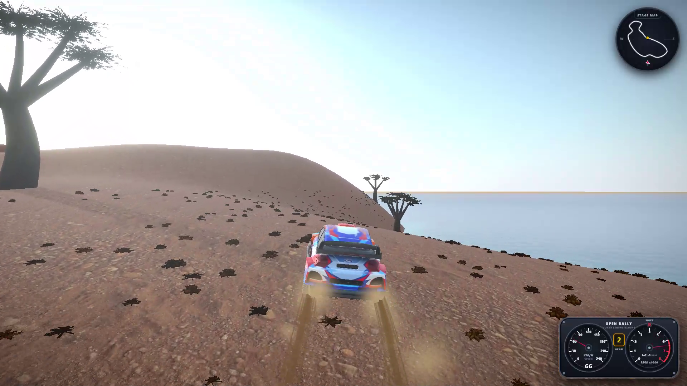
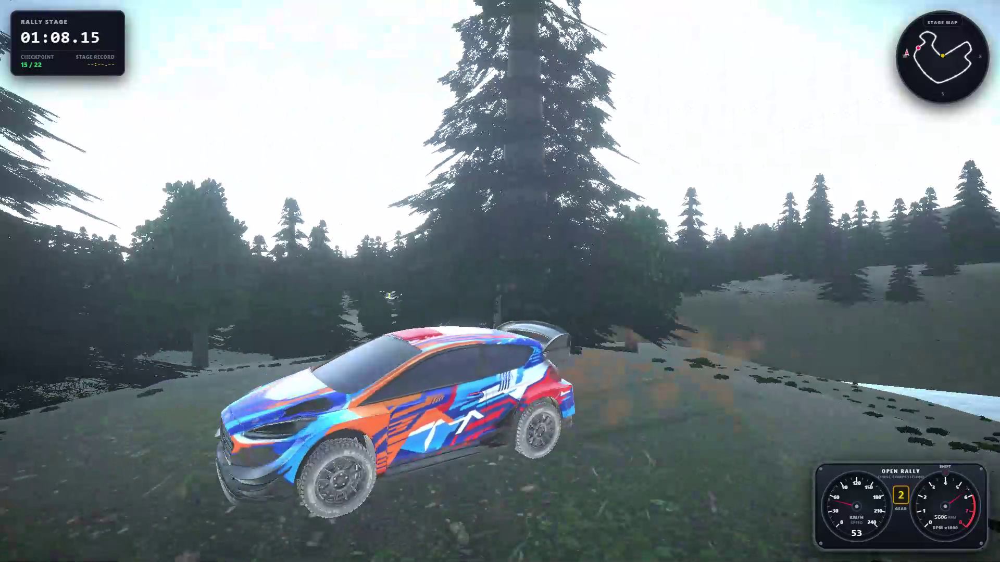
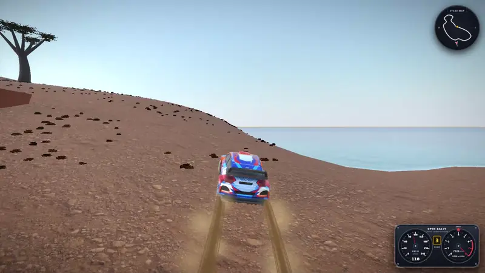
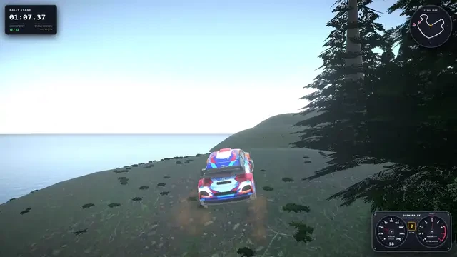
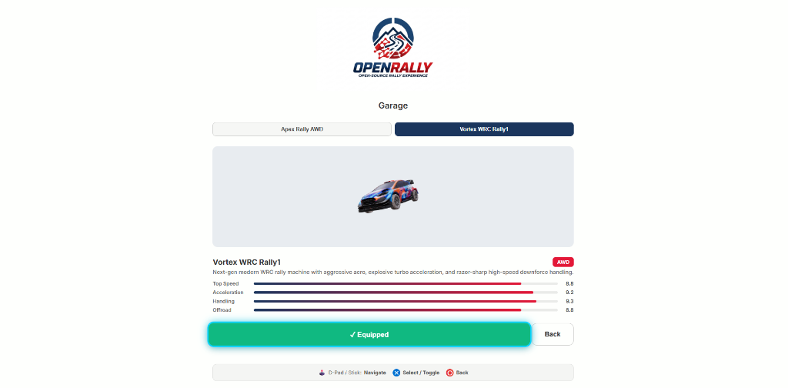
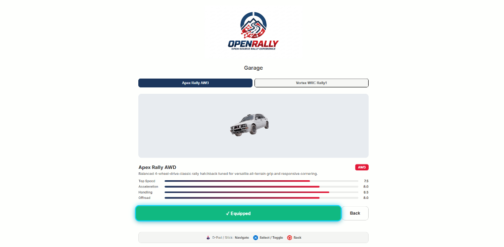

<div align="center">
  

  <h1>OpenRally</h1>

  <p><strong>Next-generation open-source 3D arcade-sim rally experience running directly in modern web browsers at 60+ FPS.</strong></p>

  <p>
    <a href="https://github.com/dawid10353/OpenRally/releases"></a>
    <a href="https://www.typescriptlang.org/"></a>
    <a href="https://react.dev/"></a>
    <a href="https://threejs.org/"></a>
    <a href="https://rapier.rs/"></a>
    <a href="https://vitest.dev/"></a>
    <a href="https://oxc.rs/"></a>
    <a href="LICENSE"></a>
  </p>

  <p>
    <a href="#-gameplay-video--showcase">Gameplay Video</a> •
    <a href="#-overview">Overview</a> •
    <a href="#-key-features">Key Features</a> •
    <a href="#-controls">Controls</a> •
    <a href="#-vehicles--stages">Vehicles & Stages</a> •
    <a href="#-quick-start">Quick Start</a> •
    <a href="#-tech-stack--architecture">Architecture</a> •
    <a href="#-testing--verification">Verification</a> •
    <a href="#-roadmap">Roadmap</a>
  </p>

  <br />

  <p align="center">
    
  </p>

  <p align="center">
    
    
  </p>

  <p align="center">
    
    
  </p>
</div>

---

## 🎬 Gameplay Video & Showcase

Experience the high-octane rally dynamics, dynamic Simplex terrain heightfields, and authentic raycast suspension physics in action:

> [!TIP]
> **🎥 High-Definition In-Game Video:** Watch the official **[OpenRally 1080p 60 FPS Gameplay Trailer](public/videos/openrally_trailer.mp4)** featuring full audio synthesis, checkpoint gates, and high-speed drift maneuvers.

<div align="center">
  <table>
    <tr>
      <td width="50%" align="center">
        <strong>🏜️ Desert Canyon — Big Air & Loose Sand Drifting</strong><br /><br />
        
      </td>
      <td width="50%" align="center">
        <strong>🌲 Island Circuit — High-Speed Coastal Lake Drift</strong><br /><br />
        
      </td>
    </tr>
  </table>
</div>

---

## 🌟 Overview

**OpenRally** is an open-source, production-grade 3D rally game running natively in web browsers via WebGL and WebAssembly.

The project combines authentic motorsport simulation principles with accessible arcade-style drift handling. Developed exclusively with enterprise AI software engineering standards, it features independent 4-wheel raycast suspension kinetics, dynamic physics-based engine RPM simulation, Pacejka-inspired non-linear multi-surface tire friction, procedural Simplex terrain heightfields, custom GLSL Gerstner wave water, modular 3D race gantries, and analog rally cockpit instrumentation.

---

## 🏎️ Key Features

### ⚙️ Authentic Rally Physics & Vehicle Dynamics
- **Raycast Suspension Kinetics:** Independent 4-wheel raycast suspension powered by **Rapier3D (WASM)** with authentic spring rates, compression/relaxation damping, anti-roll bars (ARB), wheel bottoming-out detection, and dynamic longitudinal/lateral weight transfer.
- **Physics-Based Engine & RPM Simulation:** Real-time RPM calculations driven by wheel rotation speeds, clutch slippage, throttle inertia, idle bounce, and redline limiter bounce.
- **Powertrain & Automatic Gearbox:** 5-speed automatic transmission with tuned gear ratios, torque curves, engine braking, and automatic upshift/downshift hysteresis.
- **Pacejka-Inspired Multi-Surface Friction:** Non-linear tire grip curves simulating slip angles, traction limits, understeer/oversteer transitions, and responsive handbrake-initiated power slides.
- **Arcade-Sim Driving Assists:** Speed-sensitive steering scaling, yaw damping, and drift grip multipliers for high accessibility paired with deep driving satisfaction.

### 🏁 Time Attack & Race Management
- **3-2-1-GO Start Sequence:** Dynamic start countdown with synthesized WebAudio countdown beeps, input locking during the countdown, and instant launch on GO.
- **Split Times & Live Deltas:** Real-time sector timing with delta indicators (green/red) comparing current pace against the personal best lap.
- **Stage Progression & Lap Tracking:** Start/finish gantries, intermediate sector checkpoints, lap time recording, and instant stage reset.

### 🧭 Classic Motorsport Instrumentation & HUD
- **Twin-Gauge Rally Cluster:** Authentic analog cockpit instruments featuring a 240 km/h speedometer, 8,000 RPM tachometer with redline zone, flashing **Shift Light LED**, and retro amber gear display.
- **Stage Roadbook Minimap:** Real-time 2D track overview with compass cardinal directions (N, S, E, W), start/finish checkpoints, vehicle orientation tracking, and elevation markers.
- **Interactive Pause & Garage Menu:** Full-featured tabbed menu overlay to switch vehicles, change stages, adjust graphics/audio/controls settings, or toggle telemetry on the fly.
- **Real-Time Engineering Telemetry:** On-demand telemetry overlay (`T` key) displaying chassis velocities, G-forces, slip angles, suspension travel, and engine state.

### 🏔️ Procedural Terrains & Dynamic Surface Registry
- **Multi-Octave Terrain Engine:** Procedural terrain generation using continuous Simplex noise with erosion curves, realistic hills, valleys, and physics heightfield colliders.
- **Dynamic Surface Physics:** Distinct friction models, rolling resistance, dust color signatures, and acoustics across **Tarmac, Mud, Grass, Sand, and Gravel**.

### ✨ Commercial-Grade VFX & Environmental Systems
- **Modular 3D Race Architecture:** Checkpoint gates and start/finish gantries with truss frames, sponsor banners, spotlights, digital LED timers, and carbon-fiber textures.
- **Procedural Gerstner Wave Water:** Custom GLSL water shaders with multi-wave displacement, foam edge blending, sun specular highlights, and Fresnel reflectance.
- **Surface-Aware Particle Systems:** High-performance typed-array particle pools generating dynamic dust plumes, gravel kickback, and water spray.
- **Zero-GC Tire Skid Ribbons:** Continuous procedural ribbon mesh geometry rendering tire skid marks with fade-out animations.
- **Cinematic Post-Processing:** Adaptive Bloom, Vignette, Tone Mapping, and speed motion feel.

### 🔊 Procedural Audio & Dual-Mode Soundtrack
- Synthesized WebAudio engine sound simulating engine load, pitch shifts, and RPM harmonics in real-time.
- Procedural countdown start tones, tire squeal, surface rumble, and water splash acoustics.
- Dynamic in-game background music for both menu navigation and rally stages.

---

## 🎮 Controls

OpenRally provides seamless support for **Keyboard** and **Gamepads** (PlayStation DualSense, DualShock 4 & Xbox Controllers with progressive analog trigger support, vibration haptics, and full UI navigation):

| Action | Keyboard | Gamepad (Xbox / PlayStation) | Description |
|---|---|---|---|
| **Steer Left / Right** | `A` / `D` or `←` / `→` | **Left Stick** / `D-Pad` | Speed-sensitive steering scaling |
| **Throttle / Accelerate** | `W` or `↑` | **Right Trigger (`RT` / `R2`)** / `A` (`Cross`) | Progressive analog acceleration |
| **Brake / Reverse** | `S` or `↓` | **Left Trigger (`LT` / `L2`)** / `B` (`Circle`) | 4-wheel braking & reverse gear |
| **Handbrake** | `Space` | **`X` / `Square`** | Rear-wheel lockup to initiate power slides |
| **Change Camera** | `C` | **`Y` / `Triangle`** | Switch between Chase, Bumper, and Free Views |
| **Reset Vehicle** | `R` | **`Back` / `Select` / `Share`** | Respawn vehicle on track spawn position |
| **Toggle Telemetry** | `T` | — | Real-time engineering telemetry HUD |
| **Pause / Menu** | `Esc` | **`Start` / `Options`** | Open garage, tracks, settings, or options |
| **Navigate Menus** | `W` / `S` / `Enter` | **`D-Pad` / `Left Stick` / `A` (`Cross`)** | Full gamepad navigation across all menus |

---

## 🚗 Vehicles & Stages

### Playable Vehicles (Garage)

<div align="center">
  
  
</div>

<br />

| Vehicle | Class | Drivetrain | Top Speed | Handling | Character |
|---|---|---|---|---|---|
| **Apex Rally AWD** | Classic Group A Rally | AWD (50/50) | 240 km/h | ★★★★★ | Dedicated 3D rally legend with forgiving suspension, balanced AWD grip, and agile cornering. |
| **Vortex Rally1** | Modern Rally1 | AWD (50/50) | 265 km/h | ★★★★★ | Next-gen modern Rally1 machine with aggressive aero, explosive turbo acceleration, and razor-sharp downforce handling. |

### Available Stages & Tracks

| Stage | Environment | Surfaces | Description |
|---|---|---|---|
| **Island Circuit** | Coastal Archipelago | Mud, Grass, Tarmac | Scenic coastal curves, green hills, ocean vistas, and fast flowing elevation changes. |
| **Desert Canyon** | Arid Badlands | Sand, Gravel, Rock | Dusty canyon corridors, loose dunes, sharp switchbacks, and elevation drops. |

---

## 🚀 Quick Start

### Prerequisites
- **Node.js** (v18.0.0 or higher recommended)
- **npm** (v9.0.0 or higher)
- Modern WebGL2-compatible web browser (Chrome, Edge, Firefox, Brave, Safari)

### Installation & Running Locally

1. **Clone the repository:**
   ```bash
   git clone https://github.com/dawid10353/OpenRally.git
   cd OpenRally
   ```

2. **Install dependencies:**
   ```bash
   npm install
   ```

3. **Start the development server:**
   ```bash
   npm run dev
   ```

4. **Open the game:**
   Navigate to [`http://localhost:5173`](http://localhost:5173) in your browser.

---

## 🛠️ Tech Stack & Architecture

```
OpenRally Architecture
├── 3D Rendering:       React Three Fiber (R3F) + Three.js
├── Physics Simulation:   @react-three/rapier (Rapier3D WASM Raycast Vehicle)
├── State Management:   Zustand (gameStore, settingsStore, racingStore)
├── UI & HUD:           React 19 + SVG Instrumentation + CSS Modules
├── Post-Processing:    @react-three/postprocessing (Bloom, Vignette, ToneMapping)
├── Audio Engine:       WebAudio API (procedural synthesis & sampling)
├── Testing & QA:       Vitest (178+ automated tests) + Oxlint + Strict TypeScript
└── Bundler & Dev:      Vite 8
```

### Key Architectural Patterns
- **Centralized Registry Pattern:** Vehicle configurations, tracks, and surface physics are managed through decoupled, strongly-typed registries (`vehicleRegistry.ts`, `levelRegistry.ts`, `surfaceRegistry.ts`).
- **Zero-GC Hot Execution Loops:** All matrix transformations, quaternion rotations, and raycast calculations reuse module-level scratch instances (`_vec3`, `_quat`, `_euler`), preventing garbage collection stutters.
- **Transient HUD DOM Subscriptions:** Speedometer, tachometer needle rotations, and shift light DOM updates subscribe directly to store state without triggering React component re-renders.
- **Fail-Fast Runtime Validation:** Schemas for presets, levels, and surfaces are validated at runtime (`src/utils/validation/`) with automated self-checks (`src/utils/diagnostics/`).

### In-Depth Documentation
- 📖 **[System Architecture & Data Flow](docs/ARCHITECTURE.md)**: Coordinates (+Y Up, +Z Forward, +X Right), execution loops, and subsystem design.
- 🛠️ **[Extension Guides (Cookbook)](docs/EXTENSION_GUIDES.md)**: Step-by-step recipes for adding new 3D vehicles, stages, surfaces, and UI overlays.
- 🧪 **[Debugging & Testing Guide](docs/DEBUGGING_AND_TESTING.md)**: Physics wireframe inspection, diagnostics, and testing workflows.

---

## 🧪 Testing & Verification

OpenRally enforces strict quality gates with zero tolerance for regressions:

```bash
# Run complete verification suite (Typecheck + Lint + Vitest 178 tests)
npm run check

# Run unit tests only
npm test

# Run unit tests in interactive watch mode
npm run test:watch

# Run Oxlint linter
npm run lint

# Run strict TypeScript compilation check
npm run typecheck
```

---

## 🗺️ Roadmap

- [x] **Stage 1 — Foundation (Completed):** Procedural heightmap terrain, Rapier raycast vehicle physics, chase/bumper cameras, HUD, lighting.
- [x] **Stage 2 — Simulation & Polish (Completed):** Particle systems, synthesized WebAudio, surface friction curves, skid ribbons, checkpoint racing system, Vitest test suite.
- [x] **Stage 3 — Expansion (Current Stage):**
  - [x] Dedicated 3D GLB vehicle models (`Apex Rally AWD`, `Vortex Rally1`) with raycast suspension & tire physics
  - [x] Authentic analog rally instrumentation (Speedometer, Tachometer, Shift Light, Gear Display)
  - [x] Stage roadbook minimap with compass directions and elevation awareness
  - [x] Multi-track stage registry (Island Circuit, Desert Canyon)
  - [x] Modular 3D race architecture (start/finish gantries, sector gates, race textures)
  - [x] Time Attack 3-2-1-GO countdown sequence with audio beeps & split time delta tracking
  - [x] Physics-based dynamic engine RPM simulation with inertia & limiter bounce
  - [x] Full gamepad navigation, customizable deadzones, and progressive analog control
  - [ ] Additional vehicle models (RWD Sports Coupe, Desert Trophy Truck)
  - [ ] Hillclimb & rallycross stages
- [ ] **Stage 4 — Future Visions:**
  - [ ] Real-time multiplayer (WebRTC / WebSockets)
  - [ ] Procedural track editor & terrain sculptor
  - [ ] Dynamic weather simulation (rain, wet asphalt reflections, fog)
  - [ ] Automated AI asset generation pipeline

---

## 📄 License

This project is open-source and licensed under the **[MIT License](LICENSE)**.

---

<div align="center">
  <sub>Developed with ❤️ by AI for motorsport and open-source gaming enthusiasts.</sub>
</div>
