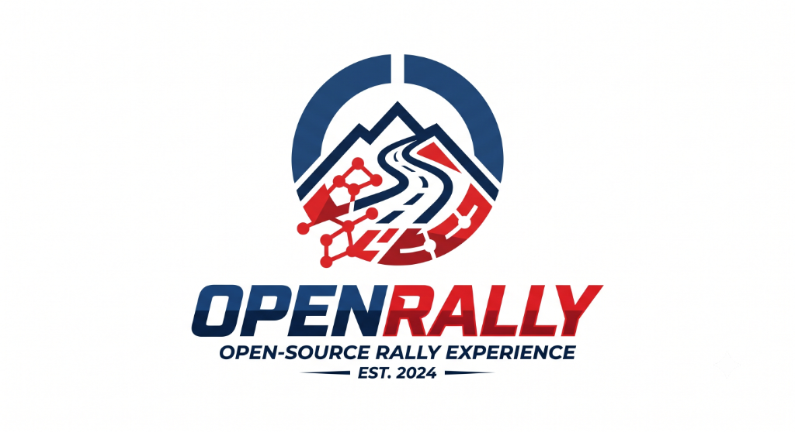
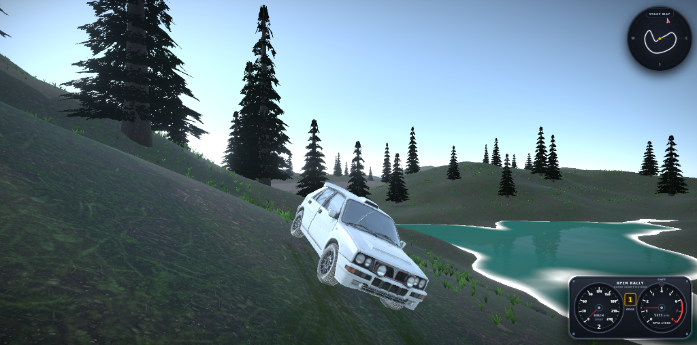

<div align="center">
  

  <h1>OpenRally</h1>

  <p><strong>Next-generation open-source 3D arcade-sim rally experience running directly in the browser.</strong></p>

  <p>
    <a href="https://www.typescriptlang.org/"></a>
    <a href="https://react.dev/"></a>
    <a href="https://threejs.org/"></a>
    <a href="https://rapier.rs/"></a>
    <a href="https://vitest.dev/"></a>
    <a href="https://oxc.rs/"></a>
    <a href="LICENSE"></a>
  </p>

  <p>
    <a href="#-gameplay-preview">Gameplay Preview</a> •
    <a href="#-key-features">Key Features</a> •
    <a href="#-quick-start">Quick Start</a> •
    <a href="#-controls">Controls</a> •
    <a href="#-vehicles--stages">Vehicles & Stages</a> •
    <a href="#-tech-stack--architecture">Architecture</a> •
    <a href="#-testing--verification">Verification</a> •
    <a href="#-roadmap">Roadmap</a>
  </p>

  <br />

  
</div>

---

## 🌟 Overview

**OpenRally** is an open-source, production-grade 3D rally game running natively in web browsers at 60+ FPS via WebGL.

The core philosophy of this project is to build a commercial-grade, authentic racing simulator developed **exclusively by Artificial Intelligence (AI)** — from WASM raycast vehicle dynamics, suspension kinetics, and procedural terrain synthesis to custom GLSL shaders and classic analog rally instrumentation.

---

## 🏎️ Key Features

### ⚙️ Authentic Rally Physics & Vehicle Dynamics
- **Raycast Suspension Kinetics:** Independent 4-wheel raycast suspension powered by **Rapier3D (WASM)** with authentic spring rates, compression/relaxation damping, anti-roll bars (ARB), and dynamic weight transfer.
- **Pacejka-Inspired Multi-Surface Friction:** Non-linear tire grip curves simulating slip angles, traction limits, understeer/oversteer transitions, and responsive handbrake-initiated slides.
- **Powertrain & Automatic Gearbox:** 5-speed automatic transmission with torque curves, engine braking, RPM harmonic calculations, and simulated AWD/RWD differentials.
- **Arcade-Sim Assists:** Speed-sensitive steering curves, yaw damping, and drift grip multipliers for high accessibility paired with deep driving satisfaction.

### 🧭 Classic Motorsport Instrumentation & HUD
- **Twin-Gauge Rally Cluster:** Authentic analog cockpit instruments featuring a 240 km/h speedometer, 8,000 RPM tachometer with redline zone, flashing **Shift Light LED**, and retro amber gear display.
- **Stage Roadbook Minimap:** Real-time 2D track overview with compass cardinal directions (N, S, E, W), start/finish checkpoints, and orientation tracking.
- **Clean Gameplay Immersion:** Zero clutter in Free Roam; dedicated rally timing board with split times and personal records in Time Attack mode.

### 🏔️ Procedural Terrains & Dynamic Surface Registry
- **Multi-Octave Terrain Engine:** Procedural terrain generation using continuous Simplex noise with erosion curves, realistic hills, valleys, and physics heightfield colliders.
- **Dynamic Surface Physics:** Distinct friction models, rolling resistance, dust color signatures, and acoustics across **Tarmac, Mud, Grass, Sand, and Gravel**.

### ✨ Commercial-Grade VFX & Environmental Systems
- **Surface-Aware Particle Systems:** High-performance particle pools generating dynamic dust plumes, gravel kickback, and water spray.
- **Zero-GC Tire Skid Ribbons:** Continuous procedural ribbon mesh geometry rendering tire skid marks with fade-out animations.
- **Procedural Gerstner Wave Water:** Custom GLSL water shaders with wave displacement, foam blending, and Fresnel reflectance.
- **Cinematic Post-Processing:** Adaptive Bloom, Vignette, Tone Mapping, and speed motion feel.

### 🔊 Procedural Audio & Dual-Mode Soundtrack
- Synthesized WebAudio engine sound simulating engine load, pitch shifts, and RPM harmonics in real-time.
- Procedural tire squeal, surface rumble, and water splash acoustics.
- Dynamic in-game background music for both menu navigation and rally stages.

---

## 🎮 Controls

OpenRally provides seamless support for **Keyboard** and **Gamepads** (PlayStation DualSense & Xbox Controllers with progressive analog trigger support):

| Action | Keyboard | Gamepad (Xbox / PlayStation) | Description |
|---|---|---|---|
| **Steer Left / Right** | `A` / `D` or `←` / `→` | **Left Stick** / `D-Pad` | Speed-sensitive steering scaling |
| **Throttle / Accelerate** | `W` or `↑` | **Right Trigger (`RT` / `R2`)** / `A` | Progressive analog acceleration |
| **Brake / Reverse** | `S` or `↓` | **Left Trigger (`LT` / `L2`)** / `B` | 4-wheel braking & reverse gear |
| **Handbrake** | `Space` | **`X` / `Square`** | Rear-wheel lockup to initiate power slides |
| **Change Camera** | `C` | **`Y` / `Triangle`** | Switch between Chase, Bumper, and Free Views |
| **Reset Vehicle** | `R` | **`Back` / `Select`** | Respawn vehicle on track spawn position |
| **Toggle Telemetry** | `T` | — | Real-time engineering telemetry HUD |
| **Pause / Menu** | `Esc` | **`Start` / `Options`** | Open garage, tracks, settings, or options |
| **Navigate Menus** | `W` / `S` / `Enter` | **`D-Pad` / `Left Stick` / `A` (`Cross`)** | Full gamepad navigation across all menus |

---

## 🚗 Vehicles & Stages

### Playable Vehicles (Garage)

| Vehicle | Class | Drivetrain | Top Speed | Handling | Character |
|---|---|---|---|---|---|
| **Apex Rally AWD** | Classic Group A Rally | AWD (50/50) | 240 km/h | ★★★★★ | Dedicated 3D rally legend with forgiving suspension, balanced AWD grip, and agile cornering. |
| **Vortex WRC Rally1** | Modern WRC Rally1 | AWD (50/50) | 265 km/h | ★★★★★ | Next-gen modern WRC machine with aggressive aero, explosive turbo acceleration, and razor-sharp downforce handling. |

### Available Stages & Tracks

| Stage | Environment | Surfaces | Description |
|---|---|---|---|
| **Island Circuit** | Coastal Archipelago | Mud, Grass, Tarmac | Scenic coastal curves, green hills, ocean vistas, and fast flowing elevation changes. |
| **Desert Canyon** | Arid Badlands | Sand, Gravel, Rock | Dusty canyon corridors, loose dunes, sharp switchbacks, and elevation drops. |

---

## 🚀 Quick Start

### Prerequisites
- **Node.js** (v18.0.0 or higher recommended)
- **npm** (v9.0.0 or higher)

### Installation & Running Locally

1. **Clone the repository:**
   ```bash
   git clone https://github.com/dawid10353/OpenRally.git
   cd OpenRally
   ```

2. **Install dependencies:**
   ```bash
   npm install
   ```

3. **Start the development server:**
   ```bash
   npm run dev
   ```

4. **Open the game:**
   Navigate to [`http://localhost:5173`](http://localhost:5173) in your browser.

---

## 🛠️ Tech Stack & Architecture

```
OpenRally Architecture
├── 3D Rendering:     React Three Fiber (R3F) + Three.js
├── Physics Simulation: @react-three/rapier (Rapier3D WASM Raycast Vehicle)
├── State Management: Zustand (gameStore, settingsStore, racingStore)
├── UI & HUD:         React 19 + SVG Instrumentation + Vanilla CSS
├── Post-Processing:  @react-three/postprocessing (Bloom, Vignette, ToneMapping)
├── Audio Engine:     WebAudio API (procedural synthesis & sampling)
├── Testing & QA:     Vitest (131+ automated tests) + Oxlint + Strict TypeScript
└── Bundler & Dev:    Vite 8
```

### Architecture Highlights
- **Centralized Registry Pattern:** Vehicle configurations, tracks, and surface physics are managed through dedicated registries (`vehicleRegistry.ts`, `levelRegistry.ts`, `surfaceRegistry.ts`).
- **Zero-GC Hot Execution Loops:** All matrix transformations, quaternion rotations, and raycast calculations reuse module-level scratch instances (`_vec3`, `_quat`, `_euler`), preventing garbage collection stutters.
- **Transient HUD DOM Updates:** Speedometer, tachometer needle rotations, and shift light DOM updates subscribe directly to store state without triggering React re-renders.
- **Fail-Fast Runtime Validation:** Schemas for presets and levels are validated at runtime (`src/utils/validation/`) with automatic self-checks (`src/utils/diagnostics/`).

For detailed documentation, consult the `/docs/` directory:
- 📖 **[System Architecture & Data Flow](docs/ARCHITECTURE.md)**: Coordinates (+Y Up, +Z Forward, +X Right), execution loops, and subsystem design.
- 🛠️ **[Extension Guides (Cookbook)](docs/EXTENSION_GUIDES.md)**: Step-by-step recipes for adding new 3D vehicles, stages, surfaces, and UI overlays.
- 🧪 **[Debugging & Testing Guide](docs/DEBUGGING_AND_TESTING.md)**: Physics wireframe inspection, diagnostics, and testing workflows.

---

## 🧪 Testing & Verification

OpenRally enforces strict quality gates with zero tolerance for regressions:

```bash
# Run complete verification suite (Typecheck + Lint + 131 Tests)
npm run check

# Run unit tests only
npm test

# Run unit tests in interactive watch mode
npm run test:watch

# Run Oxlint linter
npm run lint

# Run strict TypeScript compilation check
npm run typecheck
```

---

## 🗺️ Roadmap

- [x] **Stage 1 — Foundation (Completed):** Procedural heightmap terrain, Rapier raycast vehicle physics, chase/bumper cameras, HUD, lighting.
- [x] **Stage 2 — Simulation & Polish (Completed):** Particle systems, synthesized WebAudio, surface friction curves, skid ribbons, checkpoint racing system, Vitest test suite.
- [x] **Stage 3 — Expansion (Current Focus):**
  - [x] Dedicated 3D GLB vehicle model (`Apex Rally AWD`) with raycast suspension & tire physics
  - [x] Authentic analog rally instrumentation (Speedometer, Tachometer, Shift Light, Gear Display)
  - [x] Stage roadbook minimap with compass directions
  - [x] Multi-track stage registry (Island Circuit, Desert Canyon)
  - [x] Full gamepad navigation & haptic rumble support
  - [ ] Additional vehicle model imports (RWD Sports, Trophy Truck, Buggy)
  - [ ] Hillclimb & rallycross stages
- [ ] **Stage 4 — Future Visions:**
  - [ ] Real-time multiplayer (WebRTC / WebSockets)
  - [ ] Procedural track editor & terrain sculptor
  - [ ] Dynamic weather simulation (rain, wet asphalt reflections, fog)
  - [ ] Automated AI asset generation pipeline

---

## 📄 License

This project is open-source and licensed under the **[MIT License](LICENSE)**.

---

<div align="center">
  <sub>Developed with ❤️ by AI for motorsport and open-source gaming enthusiasts.</sub>
</div>
