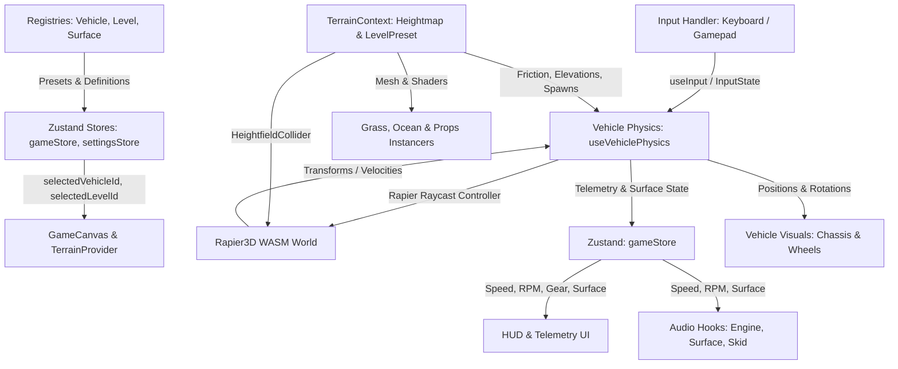

# OpenRally — System Architecture & Data Flow

This document describes the high-level architecture, coordinate systems, execution loops, registries, validators, and state management of OpenRally to help AI agents navigate, extend, and refactor the codebase with full confidence.

---

## 1. High-Level Architecture

OpenRally is built as a modular React Three Fiber (Three.js) + Rapier Physics simulation:

---

## 2. Coordinate System & Conventions

OpenRally follows standard **Three.js Right-Handed Cartesian Coordinates**:

| Axis | World Space | Vehicle Local Space |
|---|---|---|
| **+X** | East / Right | **Vehicle Right** |
| **-X** | West / Left | **Vehicle Left** |
| **+Y** | **Up** (Sky) | **Vehicle Up** (Roof) |
| **-Y** | **Down** (Gravity: -9.81 m/s²) | **Vehicle Down** (Ground) |
| **+Z** | South / Forward | **Vehicle Forward** (Front Bumper) |
| **-Z** | North / Back | **Vehicle Backward** (Rear Bumper) |

> [!IMPORTANT]
> - Vehicle forward direction is along **+Z**.
> - Wheels are indexed in standard automotive order:
>   - Index `0`: Front Left (`FL`)
>   - Index `1`: Front Right (`FR`)
>   - Index `2`: Rear Left (`RL`)
>   - Index `3`: Rear Right (`RR`)

---

## 3. The Registry Pattern & Centralized Registries

To make adding new content frictionless and modular for AI agents, the codebase uses centralized registries:

1. **`VehicleRegistry` (`src/config/vehicleRegistry.ts`)**:
   - Manages all playable vehicles (`rally_hatchback`, `rally_coupe`, `desert_truck`).
   - Pairs 3D GLB model paths, visual scale/offset offsets, UI stats, and `VehicleConfig`.
   - Access via `getVehiclePreset(id)` or `getAvailableVehicles()`.

2. **`LevelRegistry` (`src/config/levelRegistry.ts`)**:
   - Manages all tracks & stages (`level1_island`, `level2_desert`).
   - Encapsulates `LevelData` (heightmap noise, track spline, height brush modifiers, props), level spawn coordinates `[x, y, z]`, spawn heading, fall reset bounds, and environmental atmosphere presets.
   - Access via `getLevelPreset(id)` or `getAvailableLevels()`.

3. **`SurfaceRegistry` (`src/config/surfaceRegistry.ts`)**:
   - Centralizes physical tire grip curves, particle colors/scaling/lifetimes, and audio loop characteristics for every terrain surface (`tarmac`, `mud`, `grass`, `sand`, `snow`, `gravel`).
   - Access via `getSurfaceDefinition(surface)` or `getAllSurfaces()`.

---

## 4. Runtime & Test-Time Validators & Diagnostics (`src/utils/validation/` & `src/utils/diagnostics/`)

To prevent silent physics crashes or subtle simulation bugs during automated AI generation:
- `validateVehicleConfig(config)` / `validateVehiclePreset(preset)`: Enforces positive chassis mass/dimensions, exactly 4 wheels with positive spring/damping coefficients, and monotonically increasing steering curves.
- `validateLevelData(data)` / `validateLevelPreset(preset)`: Enforces valid heightmap subdivisions, minimum 3 track points, valid spawn points.
- `validateSurfaceDefinition(surface)`: Enforces positive grip numbers and peak slip angles within `(0, PI/2]`.
- `runGameDiagnostics()` / `assertGameIntegrity()`: Full-project health scan validating all registries, asset paths, track boundary constraints, wheel symmetry, and default identifiers.

---

## 5. Builders & Procedural Tooling (`src/utils/builders/` & `src/utils/trackGenerator.ts`)

To make AI development fast and eliminate repetitive boilerplate:
1. **`createVehiclePreset(options)`**: Instant vehicle definition using tuned archetypes (`rally`, `supercar`, `offroad`, `drift`, `buggy`) and `createSymmetricWheels()`.
2. **`createLevelPreset(options)`**: Rapid level definition with environmental archetypes (`island`, `desert`, `alpine`, `tundra`, `canyon`) with automatic spawn height and heading alignment.
3. **`generateProceduralCircuit()` / `generateSprintTrack()`**: Procedural track generators producing smooth, drivable splines with automatic bounding box and length calculations.

---

## 6. Decoupled Game Event Bus (`src/utils/events/`)

OpenRally includes a strongly typed event emitter for decoupling gameplay systems:
- Events: `lap_completed`, `checkpoint_passed`, `surface_changed`, `gear_shifted`, `vehicle_reset`, `drift_started`, `drift_ended`, `collision`.
- Subscription: `onGameEvent(event, listener)` or React hook `useGameEventListener(event, handler)`.
- Emission: `emitGameEvent(event, payload)`.

---

## 7. Frame Execution Loop (`useFrame`)

Inside `src/hooks/useVehiclePhysics.ts`, each animation frame executes in the following sequence:

1. **Delta Clamping**: `const dt = Math.min(delta, MAX_DELTA);` (prevents physics explosions after background tab switches).
2. **Input Reading**: Reads normalized throttle `[0, 1]`, brake `[0, 1]`, steering `[-1, 1]`, handbrake `boolean`.
3. **Speed & Slip Calculation**: Computes forward speed, lateral speed, and slip angle (difference between heading and velocity vector).
4. **Powertrain & Gearbox**: Computes automatic gear shifting (1-5 or Reverse) and engine RPM (`calculateRPM`). Emits `gear_shifted` on changes.
5. **Drivetrain Force**: Distributes engine torque to powered wheels based on AWD/RWD bias (`applyDrivetrain`).
6. **Tires & Friction**: Determines surface from `SurfaceRegistry`, applies Pacejka-lite friction drop-off, handbrake drift multiplier, and steering angles (`applyTireFrictionAndBrakes`). Emits `surface_changed` on changes.
7. **Aerodynamics & Assists**: Applies downforce and subtle yaw/pitch/roll anti-spin damping (`applyAerodynamics`, `applyAssists`).
8. **Suspension Anti-Roll Bars**: Balances left/right suspension compression on front and rear axles (`applyAntiRollBars`).
9. **Visual Synchronization**: Syncs visual wheel meshes with suspension travel, steering angle, and wheel roll rotation (`syncWheelVisuals`).
10. **State Store Update**: Updates `useGameStore` with latest telemetry for HUD, audio, and particle systems.

---

## 8. State Management (Zustand)

The game state is divided into three isolated stores in `src/store/`:

1. **`gameStore.ts`**:
   - `gameState`: `'menu' | 'playing' | 'paused' | 'loading'`
   - `selectedVehicleId`: Active vehicle preset ID (e.g. `'rally_hatchback'`)
   - `selectedLevelId`: Active level preset ID (e.g. `'level1_island'`)
   - Telemetry: `speed`, `lateralSpeed`, `slipAngle`, `rpm`, `gear`, `heading`, `position`, `surface`, `tireGrips`
   - Actions: `setGameState`, `setSelectedVehicleId`, `setSelectedLevelId`, `cycleCameraMode`, `togglePause`, `triggerReset`
2. **`settingsStore.ts`**:
   - Graphics & physics settings: `graphicsQuality` (`'low' | 'medium' | 'high'`), `shadowsEnabled`, `postProcessingEnabled`, `debugPhysics`
   - Audio volume sliders: `sfxVolume`, `menuMusicVolume`, `gameMusicVolume`
3. **`racingStore.ts`**:
   - Stage / Lap progression: `raceStatus`, `currentCheckpoint`, `totalCheckpoints`, `currentLapTime`, `bestLapTime`, `lapCount`, `showStageComplete`
   - Checkpoint crossing & lap time persistence via `localStorage`.

---

## 9. Directory Structure

- **`src/config/`**: Pure configuration registries, vehicle presets, and level files.
- **`src/types/`**: Strict TypeScript interfaces and types. Zero `any`.
- **`src/store/`**: Zustand state stores.
- **`src/hooks/`**: Custom hooks for input, physics, cameras, and procedural/WebAudio sound.
- **`src/components/canvas/`**: Canvas setup, postprocessing, and dynamic lighting.
- **`src/components/vehicle/`**: Visual car model, wheels, tire tracks, and dust particles.
- **`src/components/terrain/`**: Heightmap mesh, physics colliders, grass fields, and prop instancers.
- **`src/components/environment/`**: Procedural ocean, skybox, and checkpoints.
- **`src/components/ui/`**: HUD, telemetry gauges, garage vehicle selector, track selector, pause menu.
- **`src/utils/`**: Pure helper functions, math formulas, physics subroutines, validation, builders, and diagnostics.
- **`docs/`**: Guides and reference documentation for AI development.

---

## 10. Enterprise-Grade Architectural Principles

All contributors (AI and human) must strictly adhere to the following enterprise engineering standards:

1. **High Cohesion, Low Coupling & Dependency Inversion**:
   - Subsystems communicate exclusively through clearly typed contracts (interfaces) or the decoupled [Game Event Bus](file:///home/dawid/OpenRally/src/utils/events/eventBus.ts).
   - Direct mutations of foreign state or cross-domain leaks are forbidden.

2. **Garbage Collection (GC) Neutrality in Hot Simulation Loops**:
   - Animation frames (`useFrame`) and physics subroutines must produce **zero object allocations**. Re-use pre-allocated mutable math instances (`THREE.Vector3`, `THREE.Quaternion`, `THREE.Matrix4`) and primitive scratch buffers.

3. **Deterministic Resource & Memory Lifecycle**:
   - Every created WebGL geometry, material, texture, render target, or WebAudio context must have a deterministic lifecycle and explicit disposal to prevent memory/GPU resource leaks.

4. **Runtime Contract Validation & Diagnostic Integrity**:
   - All dynamic or external entities (presets, tracks, surfaces, telemetry payloads) must pass runtime schema assertions before ingestion by the engine.
   - Project integrity is continuously guarded by `assertGameIntegrity()` and automated diagnostics.

5. **Exhaustive Type Safety & Test Coverage**:
   - Zero `any` policy with strict discriminated unions.
   - Comprehensive Vitest unit tests guarding all calculations, reducers, and registries.

6. **AAA-Grade Visual Effects, Shaders & Environment Architecture**:
   - Visual and environmental effects (water, smoke, dust, vegetation, sky, weather, props) must utilize commercial-grade techniques: custom GLSL shaders (Gerstner waves, Fresnel, soft depth particles), GPU instancing (`InstancedMesh`), typed array ring-buffered particle pools (`Float32Array`), reactive physical simulation, and dynamic scalability according to user graphics settings.

